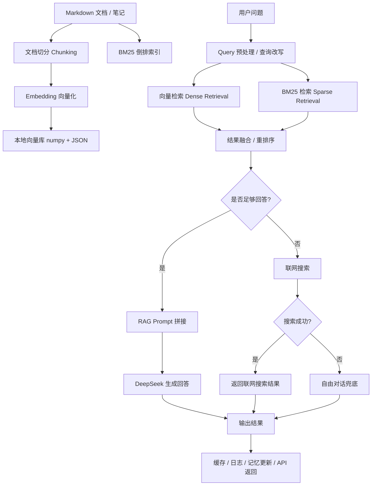
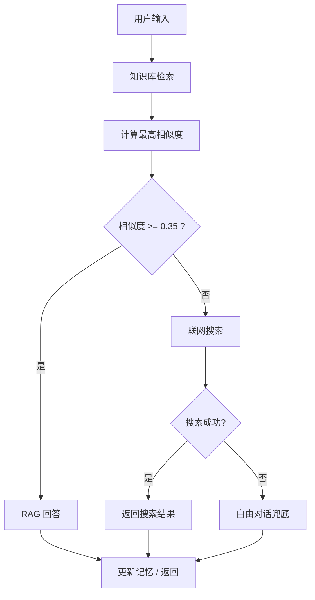

# RAG 知识库系统（四阶段演进版）

> 一个围绕 **文档知识库** 搭建的 **RAG + Agent 知识库智能问答系统**。
> 项目从 **最小可用原型（Minimal RAG）** 起步，逐步演进到 **检索优化（Hybrid Retrieval）→ Agent 智能体（Agentic RAG）→ 工程化闭环（Production-ready Project）**，完整覆盖了从 **知识库构建、检索召回、LLM 问答、Agent 决策、联网搜索、缓存优化、评测体系、Web/API 服务化** 的全链路能力。
>
> 项目在实践中解决了 **ChromaDB 兼容性问题、LangChain 导入冲突、Runnable 并发挂起、Agent 决策不稳定、联网搜索能力集成、日期幻觉、中文 Embedding 模型下载受限** 等一系列工程问题，形成了一套可复用、可迭代、可扩展的 **RAG 系统搭建范式**。
>
> **适合用于：**
>
> - 个人知识库搭建
> - 文档问答系统原型
> - AI 助手 / Copilot 类应用后端
> - RAG / Agent / 检索优化方向的工程实践项目
> -  **LLM 应用工程 / RAG / Agent 后端项目**
>
> **详细演进记录：** [docs/project-summary.md](docs/project-summary.md) · **完整使用说明：** [USAGE.md](USAGE.md) · **设计文档：** [docs/](docs/superpowers/specs/)

------

# 目录

- [1. 项目背景与目标](https://chatgpt.com/c/6a4a1ab5-80bc-83e8-b798-bbfd87193d54#1-项目背景与目标)
- [2. 项目核心能力](https://chatgpt.com/c/6a4a1ab5-80bc-83e8-b798-bbfd87193d54#2-项目核心能力)
- [3. 技术栈总览](https://chatgpt.com/c/6a4a1ab5-80bc-83e8-b798-bbfd87193d54#3-技术栈总览)
- [4. 系统整体架构](https://chatgpt.com/c/6a4a1ab5-80bc-83e8-b798-bbfd87193d54#4-系统整体架构)
- [5. 四阶段演进路线](https://chatgpt.com/c/6a4a1ab5-80bc-83e8-b798-bbfd87193d54#5-四阶段演进路线)
  - [5.1 Phase 1：最小可用 RAG 原型](https://chatgpt.com/c/6a4a1ab5-80bc-83e8-b798-bbfd87193d54#51-phase-1最小可用-rag-原型)
  - [5.2 Phase 2：检索优化与评测体系](https://chatgpt.com/c/6a4a1ab5-80bc-83e8-b798-bbfd87193d54#52-phase-2检索优化与评测体系)
  - [5.3 Phase 3：Agent 智能体与联网搜索](https://chatgpt.com/c/6a4a1ab5-80bc-83e8-b798-bbfd87193d54#53-phase-3agent-智能体与联网搜索)
  - [5.4 Phase 4：工程化闭环与服务化](https://chatgpt.com/c/6a4a1ab5-80bc-83e8-b798-bbfd87193d54#54-phase-4工程化闭环与服务化)
- [6. RAG 知识库设计详解](https://chatgpt.com/c/6a4a1ab5-80bc-83e8-b798-bbfd87193d54#6-rag-知识库设计详解)
- [7. 检索优化设计详解](https://chatgpt.com/c/6a4a1ab5-80bc-83e8-b798-bbfd87193d54#7-检索优化设计详解)
- [8. Agent 决策系统设计](https://chatgpt.com/c/6a4a1ab5-80bc-83e8-b798-bbfd87193d54#8-agent-决策系统设计)
- [9. 联网搜索与自由对话兜底](https://chatgpt.com/c/6a4a1ab5-80bc-83e8-b798-bbfd87193d54#9-联网搜索与自由对话兜底)
- [10. 缓存、日志与工程化能力](https://chatgpt.com/c/6a4a1ab5-80bc-83e8-b798-bbfd87193d54#10-缓存日志与工程化能力)
- [11. 评测体系与实验结果](https://chatgpt.com/c/6a4a1ab5-80bc-83e8-b798-bbfd87193d54#11-评测体系与实验结果)
- [12. 核心技术难点与解决方案](https://chatgpt.com/c/6a4a1ab5-80bc-83e8-b798-bbfd87193d54#12-核心技术难点与解决方案)
- [13. 项目结构说明](https://chatgpt.com/c/6a4a1ab5-80bc-83e8-b798-bbfd87193d54#13-项目结构说明)
- [14. 快速开始](https://chatgpt.com/c/6a4a1ab5-80bc-83e8-b798-bbfd87193d54#14-快速开始)
- [15. 使用方式](https://chatgpt.com/c/6a4a1ab5-80bc-83e8-b798-bbfd87193d54#15-使用方式)
- [16. 项目亮点总结](https://chatgpt.com/c/6a4a1ab5-80bc-83e8-b798-bbfd87193d54#16-项目亮点总结)
- [17. 后续可扩展方向](https://chatgpt.com/c/6a4a1ab5-80bc-83e8-b798-bbfd87193d54#18-后续可扩展方向)
- 结语
- 设计文档

------

# 1. 项目背景与目标

## 1.1 为什么要做这个项目

随着大语言模型（LLM）在问答、总结、推理、任务协同等场景中的广泛应用，**如何让模型稳定地利用私有知识进行回答**，成为构建 AI 应用时最关键的问题之一。
单纯依赖大模型原生参数知识存在以下局限：

- **无法掌握私有知识**：模型并不知道用户本地笔记、项目文档、内部知识库的内容；
- **事实可控性差**：没有检索支撑时，容易出现“编造答案”“张冠李戴”等幻觉；
- **时效性不足**：模型训练数据通常滞后，无法覆盖实时变化的信息；
- **缺乏来源可追踪性**：用户无法知道回答来自哪些文档片段，可信度较弱。

因此，项目的核心目标是：

> **构建一个从零可落地的 RAG（Retrieval-Augmented Generation，检索增强生成）系统，让 LLM 能够基于本地 Markdown 文档和知识片段进行高质量问答；并在此基础上引入 Agent 决策、联网搜索与工程化能力，形成一个完整的“知识助手”系统。**

------

## 1.2 项目要解决的问题

本项目重点解决以下几类问题：

### （1）知识接入问题

如何把分散的 Markdown 笔记 / 文档导入系统，并构造成可检索的知识库？

### （2）检索效果问题

如何避免“搜不到 / 搜不准 / 搜到了但排序不好”，提升 RAG 的召回率和答案相关性？

### （3）回答策略问题

如何让系统在“知识库有答案”和“知识库没有答案”之间做合理决策，而不是一味胡答或一味拒答？

### （4）Agent 决策问题

如何让系统具备更像“智能助手”的行为：
先判断知识库能否回答，再决定是否联网搜索，最后必要时进入自由对话兜底。

### （5）工程可用性问题

如何把一个 Demo 级的 RAG 原型演进为：

- 可复用的模块化项目
- 可服务化部署的 API
- 有缓存、日志、评测、Web UI 的完整系统

------

## 1.3 最终目标

最终系统不仅要“能问答”，还要具备以下能力：

- 支持 **Markdown 文档知识库构建**
- 支持 **中文语义向量检索**
- 支持 **混合检索（Dense + Sparse）**
- 支持 **查询改写、重排序**
- 支持 **RAG 严格问答模式**
- 支持 **Agent 决策模式**
- 支持 **联网搜索兜底**
- 支持 **自由对话兜底**
- 支持 **缓存 / 日志 / 请求追踪**
- 支持 **FastAPI 服务化 + Web 聊天界面**
- 支持 **评测体系与指标分析**

------

# 2. 项目核心能力

项目最终具备以下核心能力：

## 2.1 文档知识库构建

- 读取本地 Markdown 文档
- 文档切分为语义片段（chunks）
- 生成中文 Embedding 向量
- 将片段及其向量持久化为本地向量存储

## 2.2 RAG 问答

- 根据用户问题进行向量检索
- 召回最相关文档片段
- 将检索结果作为上下文拼接进 Prompt
- 调用 LLM 生成基于知识库的回答

## 2.3 检索优化

- 向量检索（Dense Retrieval）
- BM25 关键词检索（Sparse Retrieval）
- 混合检索融合
- 查询改写（Multi-Query）
- 关键词重排序

## 2.4 Agent 智能决策

- 基于向量相似度阈值判断知识库是否足够回答
- 如果知识库命中不足，则触发联网搜索
- 如果联网搜索失败，则回退到自由对话模式
- 通过 LangGraph 构建状态图，实现清晰的 Agent 控制流

## 2.5 联网搜索与开放域补充

- 调用 DeepSeek 的联网搜索能力
- 在本地知识库不足时补充外部信息
- 兼顾“私有知识问答”和“开放域信息获取”

## 2.6 工程化闭环

- FastAPI 提供 REST API
- Web UI 提供可交互聊天界面
- diskcache 提供响应缓存
- RotatingFileHandler 提供滚动日志
- 请求 ID 支持链路追踪
- 自定义评测体系支持效果分析

------

# 3. 技术栈总览

| 类别           | 技术                          | 用途                                         |
| -------------- | ----------------------------- | -------------------------------------------- |
| **LLM**        | DeepSeek Chat API             | 基于上下文生成回答、Agent 自由对话、联网搜索 |
| **Embedding**  | BAAI/bge-small-zh-v1.5        | 中文文本向量化，用于语义检索                 |
| **向量存储**   | numpy + JSON                  | 本地向量存储与余弦相似度检索                 |
| **检索增强**   | BM25Okapi                     | 稀疏检索 / 关键词召回                        |
| **检索编排**   | 自定义 Retriever + Reranker   | 混合检索、重排序                             |
| **RAG 框架**   | LangChain LCEL                | 检索链、Prompt 组装、模型调用                |
| **Agent 框架** | LangGraph                     | Agent 状态图、控制流、节点跳转               |
| **Web 服务**   | FastAPI + Uvicorn             | 提供 REST API 与服务化能力                   |
| **缓存**       | diskcache                     | 响应缓存，降低重复调用成本                   |
| **日志**       | logging + RotatingFileHandler | 日志落盘、滚动切分、错误排查                 |
| **前端**       | HTML + CSS + JS               | 轻量聊天界面                                 |
| **评测**       | 自定义 Metrics Runner         | Recall@k / MRR / Precision 等检索评估        |
| **运行环境**   | Python 虚拟环境               | 离线运行、便于复现                           |

------

# 4. 系统整体架构

本项目的整体架构可以拆成 **五层**：

1. **数据层（Data Layer）**：Markdown 笔记 / 文档原始数据
2. **知识库层（Knowledge Base Layer）**：文档切分、Embedding、向量存储
3. **检索层（Retrieval Layer）**：向量检索、BM25、查询改写、重排序
4. **决策与生成层（Reasoning & Generation Layer）**：RAG、Agent、联网搜索、自由对话
5. **服务层（Service Layer）**：FastAPI、Web UI、缓存、日志、评测

------

## 4.1 架构总览图



------

# 5. 四阶段演进路线

本项目最大的特点之一，是不是“一次性堆完所有功能”，而是按照 **从原型到闭环** 的思路分阶段演进。
这不仅让项目更符合真实研发过程，也能清晰体现每个阶段的技术目标、问题暴露与优化收益。

------

# 5.1 Phase 1：最小可用 RAG 原型

## 阶段目标

先验证最核心的能力：

> **能否让模型基于本地 Markdown 文档回答问题？**

这一阶段不追求“完美效果”或“复杂架构”，而是优先跑通从文档到问答的最短闭环。

------

## 实现内容

### （1）文档读取与切分

- 从本地 Markdown 目录读取笔记文件
- 将文档按固定规则切分为若干片段（chunks）

### （2）文本向量化

- 使用 `BAAI/bge-small-zh-v1.5` 对片段进行向量化
- 生成每个 chunk 对应的 embedding 向量

### （3）向量存储

- 最初尝试使用 **ChromaDB**
- 后续因兼容性问题切换为 **numpy + JSON** 的轻量本地向量库

### （4）RAG 问答链

- 用户输入问题
- 将问题向量化
- 在向量库中按余弦相似度召回 Top-k 片段
- 将召回片段拼接进 Prompt
- 调用 DeepSeek Chat 生成答案

------

## 阶段价值

这一阶段完成了项目最核心的“知识增强问答”能力，验证了：

- 本地 Markdown 笔记可以被结构化为知识库；
- 中文 embedding 模型可用于语义召回；
- 通过 Prompt 拼接上下文，LLM 可以在私有知识基础上回答问题。

------

## 阶段局限

虽然最小原型已经可用，但也暴露出明显问题：

### 1）检索效果不稳定

只依赖向量检索时，遇到以下问题较多：

- 关键词型问题召回不足
- 某些短问题匹配不准
- 相似主题文档排序不理想

### 2）没有评测体系

无法量化“检索好坏”，只能靠主观感受判断。

### 3）系统能力单一

只能做“严格 RAG 问答”，一旦知识库中没有答案，就很难处理。

因此，项目进入第二阶段：**检索优化与评测体系建设**。

------

# 5.2 Phase 2：检索优化与评测体系

## 阶段目标

在最小 RAG 原型的基础上，解决“搜不准”的问题，并建立一套可以量化优化效果的评测体系。

这一阶段的核心问题是：

> **如何让检索更强，让 RAG 的输入更准，从而提升最终回答质量？**

------

## 主要优化方向

### 1）引入 BM25 稀疏检索

仅靠向量检索，容易忽略用户问题中的明确关键词。
因此加入 BM25 作为稀疏检索补充，用于捕捉“关键词命中”的相关文档。

### 2）混合检索（Hybrid Retrieval）

将 **Dense Retrieval（向量检索）** 与 **Sparse Retrieval（BM25）** 结合，融合两者优势：

- Dense 检索擅长语义相似
- Sparse 检索擅长关键词精确命中

### 3）查询改写（Multi-Query）

对于表达模糊、信息量不足的查询，先让模型生成多个改写版本，再分别检索并融合结果，提升召回覆盖率。

### 4）重排序（Rerank / Heuristic Reorder）

在初步召回结果的基础上，根据：

- 关键词匹配程度
- 语义相似度
- 文档相关度规则
  对结果进行重排，提升最终 Top-k 质量。

### 5）建立评测集与指标

手工构建 **20 条问答样本（QA 对）**，建立检索评测流程，指标包括：

- Recall@k
- Precision@k
- MRR（Mean Reciprocal Rank）

------

## 核心收益

这一阶段最重要的成果是：

> **Recall@4 从 0.350 提升到 0.575，提升约 64%。**

这意味着：在 Top-4 召回结果中，能够命中正确知识片段的比例显著提高，为后续的回答生成奠定了更可靠的上下文基础。

------

## 阶段价值

这一阶段的意义不只是“指标提升”，更重要的是形成了**完整的检索优化方法论**：

- 不再把 RAG 当成“调个模型 API”的黑盒，而是明确意识到**检索质量决定 RAG 上限**；
- 通过评测集和指标，建立起**数据驱动的优化闭环**；
- 从“能跑”进化到“知道为什么好 / 为什么不好”。

------

# 5.3 Phase 3：Agent 智能体与联网搜索

## 阶段目标

在检索增强问答之外，让系统具备更智能的决策能力。
核心问题变成：

> **当知识库回答不了时，系统该怎么办？**

仅靠严格 RAG 的问题在于：

- 如果知识库中没有答案，系统要么胡编，要么只能回答“不知道”；
- 用户提出的问题可能超出本地知识库范围，需要外部信息；
- 单轮“检索 → 回答”的固定链路，无法体现“智能助手”的决策能力。

因此，第三阶段引入 **Agent 模式**。

------

## Agent 设计目标

让系统在收到用户问题后，不再固定走一条链，而是根据情况选择：

1. **如果本地知识库足够回答** → 走 RAG 回答
2. **如果本地知识库命中不足** → 尝试联网搜索
3. **如果联网搜索失败或不适合搜索** → 进入自由对话兜底

------

## 关键设计变化：从“LLM 判断”到“先检索再阈值判断”

这是本项目一个非常重要的技术转折点。

### 初版思路：让 LLM 决定是否搜索

最开始，Agent 的逻辑是：

- 把用户问题直接交给 LLM
- 由 LLM 判断“是否需要联网搜索”

这种做法的问题是：

- LLM 判断不稳定，容易误判
- 有时知识库明明有内容，但 LLM 仍然选择搜索
- 有时应该搜索，LLM 却直接胡答

### 优化后思路：先搜索，再用相似度阈值判断

改进后的逻辑是：

1. **先执行知识库检索**
2. 计算检索结果的最高余弦相似度
3. 如果最高相似度 ≥ 阈值（0.35），说明知识库大概率有足够相关内容 → 走 RAG
4. 如果最高相似度 < 阈值，则认为知识库不足以回答 → 尝试联网搜索

这个设计的优势非常明显：

- **决策依据从“模型主观判断”变成“检索客观结果”**
- 降低了 Agent 行为的不确定性
- 避免了知识库有内容却被跳过的问题

------

## 联网搜索能力

在知识库无法回答时，系统调用 DeepSeek 的联网搜索能力（`enable_search=True`），实现开放域补充。

这样，系统就不再只是“私有知识问答器”，而是变成：

> **优先利用私有知识；若私有知识不足，则补充互联网信息；若仍不适合，则自由对话兜底。**

------

## 阶段价值

这一阶段让项目从“RAG 系统”进一步演进成“Agentic RAG 系统”：

- 有了明确的**决策逻辑**
- 支持**多路回答策略**
- 更接近真实 AI 助手的交互体验
- 为后续的状态图控制流和工程化奠定基础

------

# 5.4 Phase 4：工程化闭环与服务化

## 阶段目标

将前三阶段的能力从“可运行的技术原型”升级为“可复用、可调用、可观察的项目系统”。

这一阶段重点不再是单一算法，而是完整的工程能力，包括：

- API 服务化
- Web 界面
- 缓存优化
- 日志监控
- 状态图控制流
- 项目文档与使用说明完善

------

## 核心工程能力

### 1）FastAPI 服务化

将问答能力封装为 REST API，支持：

- 严格 RAG 问答接口
- Agent 对话接口
- 健康检查 / 服务状态接口

这样系统不再只能通过命令行使用，而是可以被其他服务、前端页面或测试脚本调用。

------

### 2）Web 聊天界面

实现轻量前端页面，支持：

- 聊天气泡式交互
- Enter 发送、Shift+Enter 换行
- 与 FastAPI 后端联动

使项目具备“可演示性”和“可交互性”。

------

### 3）diskcache 响应缓存

对相同问题的回答进行缓存，缓存命中时直接返回结果，避免重复执行：

- BGE 向量化
- 检索流程
- LLM 调用

收益包括：

- 降低 API 成本
- 减少等待时间
- 提升系统吞吐体验

同时缓存层接口设计兼容 Redis，后续可平滑切换到更标准的线上缓存方案。

------

### 4）日志与请求追踪

引入：

- `RotatingFileHandler` 滚动日志
- 请求 ID 追踪
- 错误栈记录
- 关键路径日志（检索、决策、搜索、缓存命中等）

让系统从“黑盒”变成“可观察系统”。

------

### 5）LangGraph 状态图

用 LangGraph 替代散落的 if-else 控制流，将 Agent 决策显式建模为状态图：

- 节点：检索 / 判定 / 搜索 / 对话 / 输出
- 边：基于条件跳转
- 状态：问题、检索结果、相似度、回答、来源等

这样做的好处是：

- 控制流更清晰
- 更容易扩展新节点
- 更方便调试与状态追踪
- 更符合复杂 Agent 系统的设计方式

------

## 阶段价值

这一阶段的意义在于：

> **项目从“一个能跑的 AI Demo”，升级为“一个具备工程化闭环的 AI 应用系统”。**

也就是说，这个项目不再只是展示“我会调模型”，而是体现出：

- 我能搭建完整的知识库系统
- 我能优化检索与回答效果
- 我能设计 Agent 决策逻辑
- 我能把系统做成服务、做成界面、做成可观测项目

------

# 6. RAG 知识库设计详解

这一部分聚焦本项目最核心的 RAG 知识库部分：
**文档如何进入系统、如何被表示、如何被检索、如何参与回答。**

------

## 6.1 数据来源

项目当前知识源主要为本地 Markdown 笔记与文档。
选择 Markdown 作为主要输入源，有几个原因：

- 结构清晰，适合按标题 / 段落切分
- 便于个人知识管理、项目文档管理
- 易于离线存储与版本控制
- 与开发者工作流契合（README、设计文档、学习笔记等）

------

## 6.2 文档切分（Chunking）

文档在进入知识库前，需要先切分成可检索的片段（chunks）。
切分的目标是：

- 每个片段足够小，便于向量表示；
- 每个片段又保留足够语义上下文，便于问答。

项目采用的切分方式以 **Markdown 段落 / 标题结构** 为基础，再结合长度控制，将文档拆成适合检索的知识片段。

切分后得到的片段总数约为 **43 个**，每个片段作为知识库中的最小检索单元。

------

## 6.3 向量化（Embedding）

每个 chunk 会通过 `BAAI/bge-small-zh-v1.5` 转换为向量。
选择该模型的原因包括：

- 对中文语义表示效果较好；
- 模型体积相对适中，适合本地项目实践；
- 在问答、检索、语义匹配场景中有较好的通用表现。

向量化后，知识库中的每个 chunk 都拥有：

- 原始文本内容
- 文档来源信息
- 对应的 embedding 向量

------

## 6.4 本地向量存储设计

项目最终采用 **numpy + JSON** 作为轻量向量存储方案，而没有继续依赖 ChromaDB。

### 存储内容包括：

- `vector_store.json`：文档片段文本、元信息
- numpy 数组：embedding 向量矩阵

### 优点：

- 依赖轻量、结构可控
- 便于调试和离线运行
- 避免外部向量数据库依赖
- 对于中小规模知识库（几十到几百个 chunk）足够实用

### 局限：

- 不适合超大规模向量检索
- 缺乏 ANN（近似最近邻）能力
- 并发与线上扩展性有限

但对于本项目的定位——**个人知识库 / RAG 工程实践项目**——这是一个非常合理的权衡。

------

## 6.5 检索流程

RAG 查询的标准流程如下：

1. 用户输入问题
2. 对问题进行向量化
3. 在向量库中计算与各个 chunk 的余弦相似度
4. 召回 Top-k 候选片段
5. 结合 BM25 / 重排序做进一步筛选
6. 将最终上下文注入 Prompt
7. 调用 LLM 生成回答

------

## 6.6 RAG Prompt 设计原则

为了减少幻觉、提升答案可信度，RAG Prompt 设计遵循以下原则：

### 1）优先依据上下文回答

要求模型尽量基于召回片段作答，而不是随意发挥。

### 2）上下文不足时明确说明

避免模型在没有依据时编造答案。

### 3）保留来源意识

引导模型理解“当前回答来自笔记 / 知识库片段”，而不是纯开放域闲聊。

### 4）注入当前日期

解决“日期幻觉”问题，避免模型在涉及“今天 / 最近 / 当前”时答非所问。

------

# 7. 检索优化设计详解

检索优化是本项目技术含量最高的部分之一。
RAG 系统的回答质量，本质上高度依赖“检索出来的上下文质量”。如果检索不到相关内容，模型再强也无从回答。

因此，本项目围绕检索链路做了多轮优化。

------

## 7.1 为什么只靠向量检索不够

向量检索擅长处理“语义相近”的表达，但在以下场景容易失效：

- 用户问题中有强关键词，但语义表达较短；
- 文档里有精确术语，向量模型未必能稳定命中；
- 不同文档主题接近，容易把“相关但不准确”的片段排在前面。

举例来说，用户问：

> “项目里提到的 Recall@4 提升了多少？”

这种问题既包含明显关键词，也带有明确数值信息。
如果只依赖语义检索，未必能把包含“Recall@4 从 0.350 提升到 0.575”的片段稳定排到最前。

------

## 7.2 BM25 稀疏检索

因此项目引入 BM25 作为补充检索器。
BM25 的优势在于：

- 对关键词命中敏感
- 对“术语、缩写、数值、专有名词”类问题效果更好
- 与向量检索形成互补

Dense 检索负责“找语义相关”，BM25 负责“找关键词命中”，两者融合后能覆盖更多问题类型。

------

## 7.3 混合检索（Hybrid Retrieval）

项目中，用户查询会同时进入两条检索链：

1. **Dense Retrieval**：基于 embedding 的向量检索
2. **Sparse Retrieval**：基于 BM25 的关键词检索

然后将两路结果进行融合。
融合方式可以是简单的：

- 结果合并去重
- 按权重综合打分
- 优先保留双方都命中的文档

这种混合策略的价值在于：

- 保留语义理解能力
- 补上关键词精确命中能力
- 显著提高召回的鲁棒性

------

## 7.4 查询改写（Multi-Query）

某些用户问题表达很短、很口语化，直接检索容易不稳定。
因此项目引入了 **Multi-Query 查询改写**：

### 思路

让 LLM 先把用户原始问题改写成多个表达不同、但语义相近的查询，然后分别检索，再融合结果。

例如原始问题：

> “这个项目后来怎么优化的？”

可能被改写为：

- “项目在后续阶段做了哪些检索优化？”
- “RAG 系统在性能或效果上有哪些改进？”
- “项目从最小原型到工程化经历了哪些优化措施？”

这样可以显著提升召回覆盖面。

------

## 7.5 重排序（Reranking / Heuristic Reorder）

在召回候选片段后，项目会进一步根据规则做重排序，例如：

- 文档与问题的关键词重合度
- chunk 与问题的向量相似度
- 某些字段或主题的优先级
- 查询改写后多路召回的投票结果

虽然没有引入单独的重排序模型，但通过这些启发式规则，仍然有效改善了最终进入 Prompt 的上下文质量。

------

## 7.6 量化收益

检索优化最直接的收益体现在指标上：

> **Recall@4 从 0.350 提升到 0.575，提升约 64%。**

这说明优化后的系统在 Top-4 召回结果中，更有可能包含真正相关的知识片段。

------

# 8. Agent 决策系统设计

当项目进入 Phase 3 后，系统不再只是“检索 + 回答”的固定流水线，而是变成了一个具备决策能力的智能体。

------

## 8.1 Agent 的职责

Agent 的任务不是直接“替代 RAG”，而是负责在多种能力之间做编排与决策。
在本项目中，Agent 主要负责：

1. 先尝试从知识库中检索答案
2. 判断知识库结果是否足够可靠
3. 如果不足，则调用联网搜索
4. 如果联网搜索失败，则回退到自由对话
5. 输出结果并更新记忆

------

## 8.2 决策流程



------

## 8.3 为什么使用“相似度阈值”而不是“让 LLM 决定”

这是项目设计里非常关键的一点。

### 让 LLM 决定的问题

- 不稳定
- 难以解释
- 难以调试
- 经常忽略明明存在的知识库内容

### 相似度阈值判断的优点

- 基于客观检索结果
- 行为可控
- 便于调参
- 易于分析 bad case

项目最终采用 **0.35** 作为经验阈值，作为知识库是否“足够相关”的判断依据。

------

## 8.4 LangGraph 状态图

在工程化阶段，Agent 的控制流由 LangGraph 承载。
状态图中的核心节点包括：

- `retrieve`：执行知识库检索
- `judge`：判断相似度是否达到阈值
- `search_web`：联网搜索
- `chat_fallback`：自由对话兜底
- `respond`：整理并输出结果

这种设计相比 if-else 有几个优势：

- 控制流可视化
- 状态显式化
- 节点可扩展
- 便于后续加入更多工具（如总结、翻译、文档写作等）

------

# 9. 联网搜索与自由对话兜底

## 9.1 为什么要加联网搜索

纯本地知识库无法覆盖所有问题。
当用户问到：

- 当前热点新闻
- 知识库之外的开放域知识
- 某些需要实时更新的信息

如果系统只会回答“知识库没有相关内容”，体验会很差。

因此在知识库不足时，引入联网搜索作为补充路径。

------

## 9.2 DeepSeek 联网搜索的使用方式

项目利用 DeepSeek API 的联网搜索能力，通过 `enable_search=True` 实现搜索增强，不需要额外接入第三方搜索 API Key。

这带来的好处是：

- 接入成本低
- 实现简单
- 与现有 LLM 调用链天然兼容

------

## 9.3 自由对话兜底

如果联网搜索失败，或者问题本身更像闲聊 / 开放式提问，则系统会退回到普通 LLM 对话模式。
这样做的意义在于：

- 避免“无答案时系统直接中断”
- 保持聊天体验连贯
- 让系统具备更自然的交互能力

------

# 10. 缓存、日志与工程化能力

# 10.1 响应缓存

为了避免对相同问题重复执行完整的：

- embedding
- 检索
- LLM 生成

项目引入 `diskcache` 做响应缓存。

## 缓存策略

- Key：用户问题文本（可扩展为包含模式、上下文信息）
- Value：模型最终回答
- TTL：1 小时

## 缓存收益

- 命中时可直接返回结果
- 降低 API 成本
- 提升用户体验
- 避免 BGE 重复加载和推理

同时缓存接口设计兼容 Redis，后续如果迁移到线上环境，可以平滑替换为 Redis / KeyDB 等标准缓存系统。

------

# 10.2 日志系统

项目引入了滚动日志系统，主要记录：

- 请求 ID
- 用户输入
- 检索召回结果
- 相似度分数
- Agent 决策路径
- 缓存命中情况
- LLM / 搜索异常

日志能力的重要性在于：

- 可以定位错误与挂起问题
- 可以分析 bad case
- 可以辅助后续性能优化与行为审计

------

# 10.3 请求 ID 追踪

每个请求生成独立 Request ID，并贯穿：

- API 请求入口
- 检索日志
- Agent 决策
- 最终输出

这使得复杂链路问题能够按请求粒度排查，而不是在混杂日志中盲找。

------

# 10.4 FastAPI 服务化

项目通过 FastAPI 暴露服务接口，典型接口包括：

- `/query`：严格 RAG 问答
- `/chat`：Agent 智能对话
- `/health`：健康检查

这使项目具备以下能力：

- 可被前端页面调用
- 可被其他后端服务集成
- 可作为独立 AI 微服务部署

------

# 10.5 Web UI

前端采用纯 HTML / CSS / JS 实现轻量聊天界面，主要功能包括：

- 输入问题并发送
- 展示聊天气泡
- 兼容 Enter / Shift+Enter 交互
- 与 FastAPI 后端通信

虽然前端不复杂，但它极大提升了项目的演示效果与可交互性。

------

# 11. 评测体系与实验结果

本项目没有停留在“感觉好像更准了”的层面，而是建立了一套基础评测体系，用于量化检索优化收益。

------

## 11.1 评测集

手工构建了 **20 条 QA 对**，每条数据包含：

- 用户问题
- 标准答案或相关文档片段
- 用于判断召回是否命中的参考依据

------

## 11.2 评测指标

### Recall@k

在前 k 个检索结果中，是否包含正确文档片段。
衡量“有没有召回到”。

### Precision@k

前 k 个结果中，有多少是真正相关的。
衡量“召回结果有多干净”。

### MRR（Mean Reciprocal Rank）

正确结果第一次出现的位置的倒数平均值。
衡量“正确结果排得靠不靠前”。

------

## 11.3 实验结论

最重要的结果是：

> **Recall@4 从 0.350 提升到 0.575（+64%）**

这说明 Phase 2 的检索优化并不是“纸面升级”，而是真正改善了知识召回能力。

------

## 11.4 评测体系的意义

评测体系的价值在于：

- 帮助定位“问题出在检索还是生成”
- 支持不同策略之间的 A/B 对比
- 让优化从“拍脑袋调参”变成“基于数据迭代”

这也是项目从“玩具 Demo”迈向“工程项目”的重要标志之一。

------

# 12. 核心技术难点与解决方案

本项目在实践中遇到了多类问题，既有模型与框架兼容性问题，也有 Agent 行为与工程稳定性问题。
这些问题及其解决过程，是项目含金量的重要来源。

------

## 12.1 ChromaDB 静默崩溃

### 现象

使用 ChromaDB 作为向量数据库时，程序出现静默崩溃或异常退出。

### 根因

ONNX 默认模型缓存目录权限与环境兼容性存在问题，导致底层初始化不稳定。

### 解决方案

放弃对 ChromaDB 的强依赖，改用：

- `numpy` 保存向量矩阵
- `JSON` 保存文档片段与元信息

### 收获

虽然牺牲了“现成向量数据库”的便利性，但换来了：

- 更强的可控性
- 更少的环境依赖
- 更便于调试的本地知识库实现

------

## 12.2 LangChain 导入冲突

### 现象

导入 LangChain 相关模块时崩溃，涉及 OpenTelemetry 初始化冲突。

### 根因

`langchain_openai` 与其他 LangChain 社区包在导入顺序上触发了依赖初始化问题。

### 解决方案

调整导入顺序，确保：
`langchain_community` 先于 `langchain_openai` 导入。

### 收获

对 LangChain 的包结构与依赖初始化机制有了更深入理解，也为后续排查类似框架问题积累了经验。

------

## 12.3 RunnableParallel 挂起 / 检索链执行卡住

### 现象

链执行过程中出现挂起，尤其在 RunnableParallel / 线程池场景下调用 BGE 模型时更明显。

### 根因

Embedding 模型调用与并发执行之间存在兼容性问题，导致线程池下链式执行不稳定。

### 解决方案

调整整体流程，避免不必要的并发链式调用，采用：

- **先检索，再决定是否调 LLM**
- 降低复杂并发执行链的使用

### 收获

理解了“工程可运行性”与“框架炫技”之间的权衡：
并不是所有链式抽象都适合直接上生产逻辑，必要时要回到更稳的显式流程控制。

------

## 12.4 Agent 判断不准确

### 现象

由 LLM 自行决定“要不要搜索”时，常常出现误判。

### 根因

LLM 对“知识库是否足够回答”这种判断不稳定，且不具备可靠的可解释依据。

### 解决方案

改为：

- 先执行知识库检索
- 计算相似度
- 用阈值（0.35）判断是否触发联网搜索

### 收获

这是整个项目中最重要的设计改进之一。
它把 Agent 决策从“主观推断”变成了“基于检索结果的客观规则”。

------

## 12.5 日期幻觉

### 现象

涉及“今天 / 当前日期 / 最近”等问题时，模型可能给出错误时间判断。

### 根因

LLM 并不天然知道当前运行日期。

### 解决方案

在 Prompt 中显式注入 `current_date`。

### 收获

认识到很多看似“模型不聪明”的问题，其实是 Prompt 上下文缺失导致的，需要从系统输入层补足环境信息。

------

## 12.6 HuggingFace 模型下载受限

### 现象

BGE 模型在某些环境下无法直接从 HuggingFace 下载。

### 根因

网络访问受限。

### 解决方案

使用 `hf-mirror.com` 镜像并配置本地缓存。

### 收获

增强了项目在国内网络环境下的可复现性与可部署性。

------

# 13. 项目结构说明

```text
rag-project/
├── app/
│   ├── config.py                 # 配置项、环境变量、常量
│   ├── chain.py                  # LangChain LCEL 链封装
│   ├── ingest.py                 # 文档导入 / 向量建库
│   ├── store.py                  # 本地向量存储读写
│   ├── query.py                  # 严格 RAG 问答入口
│   ├── retriever.py              # 向量检索 / BM25 混合检索
│   ├── reranker.py               # 重排序逻辑
│   ├── query_rewriter.py         # 查询改写（Multi-Query）
│   ├── memory.py                 # 对话记忆管理
│   ├── agent.py                  # Agent 决策逻辑
│   ├── cache.py                  # 响应缓存
│   ├── logging_setup.py          # 日志初始化
│   ├── state.py                  # Agent 状态定义
│   └── graph.py                  # LangGraph 状态图
│
├── evaluation/
│   ├── metrics.py                # Recall / MRR / Precision 等指标
│   └── runner.py                 # 评测执行入口
│
├── static/
│   └── index.html                # Web 聊天界面
│
├── docs/
│   ├── project-summary.md        # 项目演进总结
│   ├── prompt-management.md      # Prompt 管理设计
│   └── superpowers/
│       ├── plans/                # 各阶段设计与计划
│       └── specs/                # 系统设计文档
│
├── api.py                        # FastAPI 服务入口
├── main.py                       # CLI 入口
├── vector_store.json             # 文档片段与元信息
├── USAGE.md                      # 使用说明
└── README.md                     # 项目概览
```

------

# 14. 快速开始

## 14.1 环境准备

```bash
git clone <your-repo-url>
cd rag-project

python -m venv .venv
.venv\Scripts\activate   # Windows
# source .venv/bin/activate  # Linux / macOS
```

安装依赖：

```bash
pip install -r requirements.txt
```

------

## 14.2 配置环境变量

在项目根目录创建 `.env` 文件：

```env
DEEPSEEK_API_KEY=sk-your-key
```

如果使用 HuggingFace 镜像 / 本地缓存，也可以补充对应配置。

------

## 14.3 建立知识库

```bash
python main.py --ingest
```

该命令会完成：

- 读取 Markdown 文档
- 切分 chunk
- 生成 embedding
- 写入本地向量库

------

## 14.4 启动不同模式

### 严格 RAG 问答

```bash
python main.py --query
```

### Agent 智能对话

```bash
python main.py --chat
```

### 启动 Web 服务

```bash
python main.py --serve
```

浏览器打开：

```text
http://localhost:8000
```

------

# 15. 使用方式

## 15.1 严格 RAG 模式

适用于：

- 明确希望基于本地知识库回答
- 不希望系统联网或自由发挥
- 关注私有知识的准确引用

特点：

- 强依赖知识库内容
- 回答可控性更强
- 适合做文档问答 / 笔记检索

------

## 15.2 Agent 模式

适用于：

- 希望系统像“智能助手”一样自己判断如何回答
- 允许在必要时联网搜索
- 问题范围不局限于本地笔记

特点：

- 优先知识库
- 知识库不足时自动搜索
- 搜索失败时自由对话兜底
- 更自然、更接近真实 Copilot 体验

------

## 15.3 API 调用示例

### 严格 RAG

```bash
curl -X POST http://localhost:8000/query \
  -H "Content-Type: application/json" \
  -d "{\"question\":\"这个项目的检索优化做了什么？\"}"
```

### Agent 聊天

```bash
curl -X POST http://localhost:8000/chat \
  -H "Content-Type: application/json" \
  -d "{\"message\":\"帮我总结一下这个项目四个阶段分别做了什么\"}"
```

------

# 16. 项目亮点总结

如果只用一句话概括这个项目，我会说：

> **这不是一个“调用 LLM API 做个聊天机器人”的 Demo，而是一个完整走过“知识库构建 → 检索优化 → Agent 决策 → 工程化闭环”的 RAG 系统项目。**

更具体地说，它的亮点包括：

------

## 16.1 从 0 到 1 完整搭建 RAG 系统

项目覆盖了：

- 文档 ingestion
- chunk 切分
- embedding
- 向量检索
- Prompt 组装
- LLM 生成

具备完整的知识库问答闭环。

------

## 16.2 做了真实的检索优化，而不是停留在“最小原型”

通过：

- BM25 混合检索
- 查询改写
- 关键词重排序
- 评测指标分析

将 Recall@4 提升了 64%，体现出对 RAG 核心瓶颈——检索——的深入理解与优化能力。

------

## 16.3 Agent 决策逻辑有明确方法论

没有简单把“Agent”理解为“多调几个模型”，而是认真处理了：

- 何时使用知识库
- 何时联网搜索
- 何时自由对话
- 决策依据如何从“LLM 主观判断”改为“相似度阈值 + 检索结果”

这使得 Agent 行为更可控、更可解释。

------

## 16.4 有较强的工程化意识

项目不仅能跑，还具备：

- FastAPI 服务化
- Web UI
- 缓存
- 日志
- 请求追踪
- 文档与阶段设计沉淀

这意味着它不只是“实验脚本”，而是一个具备工程结构和演进思路的系统项目。

------

## 16.5 解决了多个真实工程问题

包括：

- ChromaDB 环境兼容性
- LangChain 导入冲突
- RunnableParallel 并发挂起
- 日期幻觉
- 模型下载受限

这些问题都不是“照着教程抄”能自动解决的，而是需要自己分析、试错、替换方案、重构流程。

------

# 17. 后续可扩展方向

虽然当前项目已经形成较完整闭环，但如果继续往“更像企业级 AI 应用”的方向推进，还可以扩展以下能力：

------

## 17.1 向量库升级

当前使用 `numpy + JSON`，适合中小规模本地知识库。
后续可升级为：

- **Qdrant**
- **Milvus**
- **pgvector**
- **Elasticsearch + dense vector**

以支持更大规模数据、更高性能检索和更丰富的 metadata 过滤。

------

## 17.2 引入真正的 Reranker 模型

当前重排序主要基于启发式规则。
后续可引入：

- BGE reranker
- Jina reranker
- Cohere rerank

进一步提升最终 Top-k 的精度。

------

## 17.3 更细粒度的文档元信息与过滤

为 chunk 增加：

- 文档标题
- 文档类型
- 创建时间
- 标签 / 主题
- 文件路径

这样可以支持：

- 按文档类型过滤
- 按时间范围检索
- 按主题限定召回范围

------

## 17.4 对话记忆与长期记忆

当前记忆能力较轻量，后续可扩展为：

- 会话级短期记忆
- 用户画像与长期偏好记忆
- 对历史问答结果的再利用

------

## 17.5 工具调用与任务型 Agent

目前 Agent 主要负责知识问答决策。
后续可加入更多工具：

- 文档总结
- 会议纪要生成
- 周报写作
- 文档翻译
- 任务拆解与 TODO 提取

这样项目会更接近真实的 **AI 助手 / Copilot** 系统。

------

## 17.6 自动化评测平台

当前评测是脚本化的。
后续可以扩展为：

- 自动跑批评测
- 可视化报告
- Prompt / 检索策略对比实验面板
- Bad case 标注与回归测试

------

# 结语

这个项目的价值，不只在于“做出了一个能回答问题的 RAG 系统”，更在于它完整经历了一个 AI 应用从原型到工程化的关键过程：

- 从 **最小 RAG** 验证可行性；
- 到 **混合检索 + 查询改写 + 评测** 优化效果；
- 再到 **Agent 决策 + 联网搜索** 扩展能力边界；
- 最后通过 **FastAPI / 缓存 / 日志 / LangGraph / Web UI** 完成工程化闭环。

完整的能力画像：

- 能做 **RAG 知识库搭建**
- 能做 **检索优化与效果评估**
- 能做 **Agent 决策逻辑设计**
- 能做 **服务化与工程化落地**
- 能解决 **真实开发中的兼容性和稳定性问题**

## 设计文档

- [整体设计](docs/superpowers/specs/rag-knowledge-base-design.md)
- [Prompt 版本管理](docs/prompt-management.md)
- [Phase 1 minimal-RAG ](docs/superpowers/plans/phase1-minimal-rag.md)
- [Phase 2 optimized-RAG ](docs/superpowers/plans/phase2-optimized-rag.md)
- [Phase 3 Agent 设计](docs/superpowers/plans/phase3-agent-design.md)
- [Phase 4 项目闭环设计](docs/superpowers/plans/phase4-closure-design.md)
- [项目总结](docs/project-summary.md)